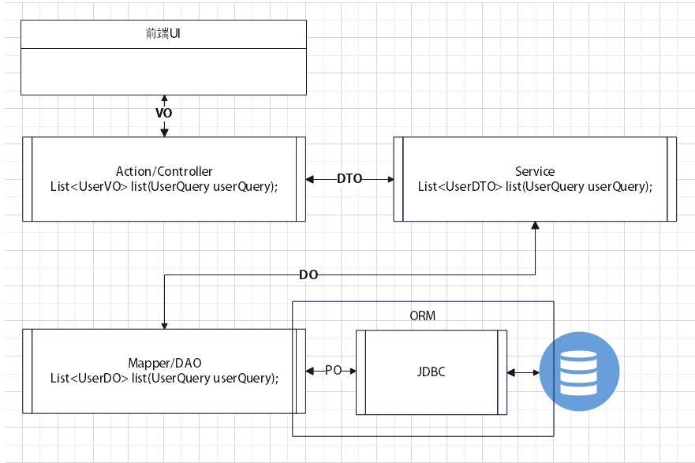

# 注意事项
(1). mapper/repository，数据访问层，与数据库交互为service提供接口(对某个表进行增删改查，一个’*Mapper.java’和一个’*Mapper.xml’对应一张表(存在关联查询的情况)；Mybatis使用的是mapper，JPA使用的是repository)
(2). entity/domain，数据实体类(Mybatis使用的是entity，JPA使用的是domain)
(3). POJO，VO，DTO，DO，PO，BO的含义：

POJO：是一个简单的、普通的JAVA对象，它包含业务逻辑处理或持久化逻辑等。但不是JavaBean、EntityBean等，不具有任何特殊角色，不继承或不实现任何其它JAVA框架的类或接口。可以包含类似与JavaBean属性和对属性访问的setter和getter方法的对象。
VO(View Object)：视图对象，用于展示层显示，代表展示层需要显示的数据。它的作用是把某个指定页面/组件需要的所有数据封装起来。
DTO(Data Transfer Object)：数据传输对象，用于服务层与持久层之间的数据传输对象，代表服务层需要接收/返回的数据。
DO(Domain Object)： 领域对象，就是从现实世界中抽象出来的有形或无形的实体对象。
PO(Persistent Object)：持久化对象，它跟持久层(通常是关系型数据库)的数据结构形成一一对应的映射关系，数据表中的每个字段(或若干个)就对应PO的一个(或若干个)属性。
BO(Business Object)： 业务对象，用于把业务逻辑封装为一个对象，这个对象可以包括一个或多个其它的对象。
POJO持久化之后 -> PO；POJO传输过程中 -> DTO；POJO用作表示层 -> VO

